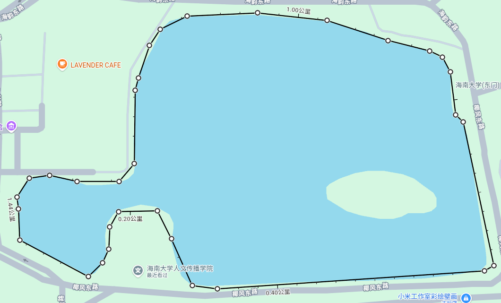
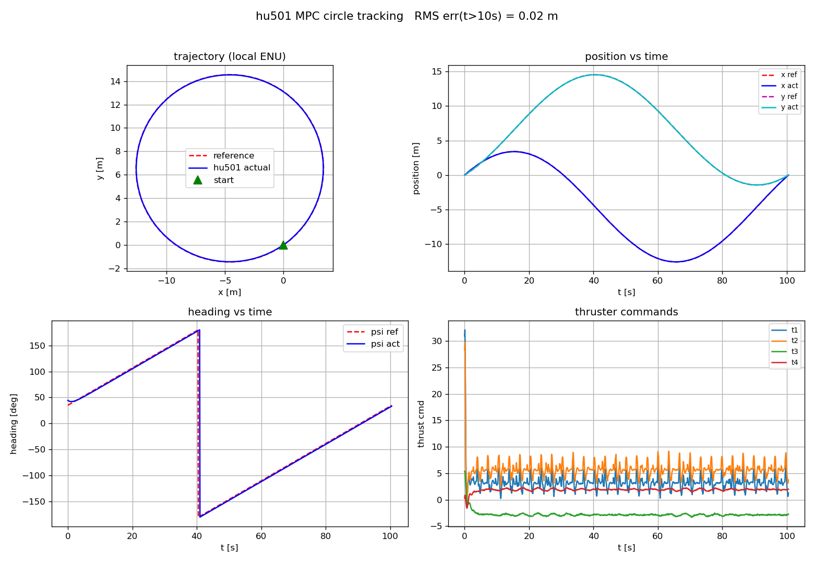

# HU501 无人艇 — VRX 仿真平台使用手册

基于 [VRX (Virtual RobotX)](https://github.com/osrf/vrx) 搭建的小型全驱动无人艇（USV）仿真平台。
自定义船体 `hu501`（船长 1.04 m、总质量 ≈ 23.4 kg、四推进器），可键盘遥控，也可编写自己的控制算法。



**轨迹跟踪效果**（圆形轨迹，稳态 RMS 误差 ≈ 0.02 m）：




---

## 1. 环境配置

本工作空间使用的 VRX 主线版本要求 **Ubuntu 24.04 + ROS 2 Jazzy + Gazebo Harmonic**（gz-sim 8.x）。

### 1.1 系统依赖

```bash
# ROS 2 Jazzy 桌面版（含 Gazebo Harmonic 的 ros_gz 集成）
sudo apt install ros-jazzy-desktop-full

# 常用工具
sudo apt install ros-jazzy-ros-gzharmonic python3-colcon-common-extensions \
                 ros-jazzy-xacro git

# Python 依赖（示例节点与画图用）
pip3 install numpy matplotlib
pip3 install casadi        # 仅轨迹跟踪节点需要
```

检查环境是否就绪：

```bash
echo $ROS_DISTRO        # 应输出 jazzy
gz sim --version        # 应输出 Gazebo Sim 8.x
```

### 1.2 工作空间内容

```
vrx_hu501_ws/
├── hu501urdf/                # ★ hu501 船体模型包
│   ├── urdf/hu501urdf.urdf.xacro   # 船体+推进器+传感器+水动力参数（都在这里改）
│   ├── meshes/*.STL                # SolidWorks 导出的网格
│   ├── worlds/dongpo_lake.sdf      # 东坡湖世界（含波场参数/GPS坐标）
│   ├── models/dongpo_lake_terrain/ # 东坡湖地形（网格+高度图+卫星贴图）
│   ├── tools/make_dongpo_terrain.py# 地形素材生成脚本
│   └── launch/                     # dual.launch.py(悉尼) / hu501.launch.py(东坡湖)
├── src/
│   ├── vrx/                  # VRX 上游源码（已包含，未修改）
│   └── my_control/           # 控制包
│       └── my_control/
│           ├── test.py       # 键盘遥控节点（key_control）
│           ├── trajectory.py # 实时轨迹绘图
│           └── mpc_node.py   # 轨迹跟踪控制节点
├── vrx_ws/mpc_results/       # 运行自动保存的结果 CSV + 图
├── 东坡湖.png / 东坡湖_卫星地图.jpg  # 东坡湖世界截图与卫星底图素材
├── results.png               # 轨迹跟踪结果图（README 展示用）
└── HU501trajectory trackingf.mp4  # 轨迹跟踪视频（README 展示用）
```

### 1.3 编译

```bash
cd ~/vrx_hu501_ws
colcon build --merge-install
source install/setup.bash          # 每开一个新终端都要 source
```

> **注意：必须使用 `--merge-install`**（把 hu501urdf、src/vrx、src/my_control
> 等全部包合并安装到同一个 `install/` 下），否则 `hu501.launch.py` 找不到
> `vrx_gz` 的资源，仿真起不来。不要用 `--symlink-install`。

可把下面两行加进 `~/.bashrc` 省去重复输入：

```bash
source /opt/ros/jazzy/setup.bash
source ~/vrx_hu501_ws/install/setup.bash
```

---

## 2. 启动 Gazebo 与话题检查

### 2.1 启动仿真

```bash
# 东坡湖世界（海南大学实测湖形，推荐）—— 地形由 tools/make_dongpo_terrain.py 生成
ros2 launch hu501urdf hu501.launch.py
ros2 launch hu501urdf hu501.launch.py headless:=true

# VRX 悉尼赛道世界（wamv + hu501 双船）
ros2 launch hu501urdf dual.launch.py
ros2 launch hu501urdf dual.launch.py headless:=true
```

- 东坡湖世界：地形/贴图/比例按实测数据（湖长 473.06 m）生成，GPS 读数为海南坐标，
  水面为平静湖面参数，hu501 与 wamv 出生在湖心。地形由
  `hu501urdf/tools/make_dongpo_terrain.py` 从卫星底图（`东坡湖_卫星地图.jpg`）
  生成，重生成方法与参数见该脚本内的注释说明。
- 悉尼世界：Gazebo 打开 `sydney_regatta`，`hu501` 与 `wamv` 并排停在起点附近。
  首次启动加载模型较慢，等终端出现 `Spawned hu501` 即就绪。

### 2.2 检查话题

新开一个终端（记得 source），确认话题正常：

```bash
ros2 topic list | grep hu501
```

应能看到（共 17 个）：

```
/hu501/joint_states
/hu501/pose
/hu501/pose_static
/hu501/robot_description
/hu501/sensors/cameras/front_camera/camera_info
/hu501/sensors/cameras/front_camera/image_raw
/hu501/sensors/cameras/front_camera/optical/camera_info
/hu501/sensors/cameras/front_camera/optical/image_raw
/hu501/sensors/gps/gps/fix
/hu501/sensors/imu/imu/data
/hu501/sensors/lidars/lidar/points
/hu501/sensors/lidars/lidar/scan
/hu501/sensors/position/ground_truth_odometry
/hu501/thrusters/t1/thrust
/hu501/thrusters/t2/thrust
/hu501/thrusters/t3/thrust
/hu501/thrusters/t4/thrust
```

常用检查命令：

```bash
ros2 topic echo /hu501/sensors/gps/gps/fix --once       # 看一帧 GPS
ros2 topic hz  /hu501/sensors/imu/imu/data             # 看传感器频率
ros2 topic info /hu501/thrusters/t1/thrust             # 看话题类型
```

### 2.3 命令行手动发推力（最快验证方式）

```bash
# 左主推发 20 N，按 Ctrl+C 停止（松开即停不下来，需再发 0）
ros2 topic pub -r 10 /hu501/thrusters/t1/thrust std_msgs/msg/Float64 "{data: 20.0}"

# 停船
ros2 topic pub -r 10 /hu501/thrusters/t1/thrust std_msgs/msg/Float64 "{data: 0.0}"
```

注意：仿真里还有一条 VRX 默认的 `wamv` 船（话题前缀 `/wamv/`），别搞混。

### 2.4 键盘遥控

```bash
ros2 run my_control key_control
```

| 按键 | 动作 | 推进器 |
|---|---|---|
| `W` | 前进 | t1 + t2 正推 |
| `S` | 后退 | t1 + t2 负推 |
| `A` | 左转 | 主推差速 + 首尾侧推反向 |
| `D` | 右转 | 主推差速 + 首尾侧推反向 |
| `Z` | 右移 | t3 + t4 |
| `X` | 左移 | t3 + t4 |
| `Q` | 退出（自动停车） | |

松开按键即自动停车（每拍检测无输入时发 0）。

---

## 3. 平台参数

全部定义在 `hu501urdf/urdf/hu501urdf.urdf.xacro`。因为用的是 `--merge-install`
（复制安装，非符号链接），**改完 URDF 后要先重新编译该包再启动**：

```bash
colcon build --merge-install --packages-select hu501urdf
```

### 3.1 质量与惯量

| 部件 | 质量 [kg] |
|---|---|
| base_link 船体 | **22.584** |
| 推进器 ×4 | 每个 ≈ 0.21 |
| 传感器（gps+imu+lidar+相机） | 合计 0.70 |
| **整船** | **≈ 23.4** |

| 惯量（绕质心）[kg·m²] | 数值 | 用途 |
|---|---|---|
| Ixx（横摇） | 0.5689 | |
| Iyy（纵摇） | 1.81792 | |
| Izz（艏摇） | **2.07173** | 控制模型中的转动惯量 m33 |

**怎么改 / 怎么用**：`<inertial>` 块的 `<mass value="..."/>` 与 `<inertia .../>`。
质量影响加速度（a = F/m）与惯量影响转向响应；控制模型中的 m11=m22=22.584、m33=2.07173
即取自这里，改 URDF 后记得同步改控制节点里的模型参数。

### 3.2 浮力与主尺度

| 参数 | 数值 | 含义 |
|---|---|---|
| hull_length | 1.04 m | 船长 |
| hull_radius | 0.13 m | 虚拟浮筒半径（双筒间距 0.26 m ≈ 船宽） |
| 采样点 | x=±0.4, y=±0.13, z=−0.2 | 每筒 3 点 |
| 平衡吃水 | ≈ 7 cm | 实船标定值 |

由 VRX `Surface` 插件（两段）实现浮力；改 `hull_radius` 或采样点 `z` 会改变吃水与稳性。

---

## 4. 水动力阻尼系数（Xu、Yv、Nr）

定义在 URDF 的 `SimpleHydrodynamics` 插件（约 325–341 行）：

```xml
<plugin filename="libSimpleHydrodynamics.so" name="vrx::SimpleHydrodynamics">
  <link_name>base_link</link_name>
  <xDotU>0.0</xDotU>  <yDotV>0.0</yDotV>  <nDotR>0.0</nDotR>   <!-- 附加质量（均为0） -->
  <xU>10.0</xU>   <xUU>15.0</xUU>     <!-- surge 纵荡：线性 / 二次 -->
  <yV>10.0</yV>   <yVV>10.0</yVV>     <!-- sway 横荡 -->
  <zW>50.0</zW>                      <!-- heave 垂荡 -->
  <kP>30.0</kP>   <kPP>60.0</kPP>     <!-- roll 横摇 -->
  <mQ>30.0</mQ>   <mQQ>60.0</mQQ>     <!-- pitch 纵摇 -->
  <nR>40.0</nR>   <nRR>40.0</nRR>     <!-- yaw 艏摇 -->
</plugin>
```

阻尼模型为**线性 + 二次**两项（Fossen 记号）：

```
纵荡阻力   Fx = −( Xu·u  + Xuu·|u|·u )
横荡阻力   Fy = −( Yv·v  + Yvv·|v|·v )
艏摇阻尼   Mz = −( Nr·r  + Nrr·|r|·r )
```

### 参数汇总表

| 自由度 | 线性项 | 二次项 |
|---|---|---|
| surge 纵荡 u | **Xu = 10.0** | **Xuu = 15.0** |
| sway 横荡 v | **Yv = 10.0** | **Yvv = 10.0** |
| yaw 艏摇 r | **Nr = 40.0** | **Nrr = 40.0** |
| heave / roll / pitch | 50 / 30 / 30 | − / 60 / 60 |

### 怎么用这些参数

1. **算最大速度**：稳态时推力=阻力，`Xu·u* + Xuu·u*² = F_total`。
   实测验证：双主推各 40 N（F=80 N）→ `10u+15u²=80` → **u\* = 2.0 m/s**，与仿真观测一致。
   阶跃标定数据（单桨合计 F=20/40/80 N）→ 稳态 u ≈ 0.87 / 1.33 / 2.0 m/s。
2. **调节运动"手感"**：调大 Xu/Xuu → 极速变低、加速变慢、超调变小；调小则相反。
   调大 Nr → 转向更"钝"；调小 → 转向灵敏但易振荡。
3. **写控制器时**：动力学模型 `m·u̇ = F_thrust − Xu·u − Xuu·u|u|`（附加质量为 0，m 直接用 22.584），
   阻尼项就是上表数值，可直接写进模型或用于前馈补偿。
4. **辨识与真值的关系**：`mpc_node.py` 内部用的是一套辨识等效参数（kt=0.35、xu1=3.5、xu2=5.3、yv1=6.0、nr=17.0），
   与 URDF 真值是同一物理的不同缩放；**改了 URDF 阻尼后应重新标定**（方法：不同推力阶跃测稳态速度再拟合）。

---

## 5. 推进器布局与推力分配

### 5.1 四推进器（船体系：x 前、y 左）

| 推进器 | 位置 (x, y) [m] | 正推力方向 | 作用 |
|---|---|---|---|
| t1 主推 | (−0.01, +0.23) | +x 前进 | 左舷 |
| t2 主推 | (−0.01, −0.23) | +x 前进 | 右舷 |
| t3 侧推 | (+0.44, −0.03) | −y 向右舷 | 船首 |
| t4 侧推 | (−0.44, −0.03) | −y 向右舷 | 船尾 |

### 5.2 推力分配矩阵 B

推力指令 **t** = [t1, t2, t3, t4]ᵀ → 广义力 **τ** = [X, Y, N]ᵀ（前进力/横向力/艏摇力矩）：

```
      ┌ 1     1     0     0  ┐       X = t1 + t2
 τ =  │ 0     0    −1    −1  │ · t   Y = −(t3 + t4)
      └ −0.23 0.23 −0.44 0.44┘       N = 0.23(t2 − t1) + 0.44(t4 − t3)
```

（0.23 = 主推横向力臂，0.44 = 侧推纵向力臂，均取自 URDF 关节坐标。）

### 5.3 逆分配（给定期望力求四路指令）

最小范数解 t = B⁺τ（Moore–Penrose 伪逆）：

```python
import numpy as np
B = np.array([[1, 1, 0, 0],
              [0, 0, -1, -1],
              [-0.23, 0.23, -0.44, 0.44]])
Bp = np.linalg.pinv(B)          # 即下面这个矩阵

# Bp ≈ [[ 0.5, -0.0, -0.4665],     t1 = 0.5·X − 0.4665·N
#       [ 0.5,  0.0,  0.4665],     t2 = 0.5·X + 0.4665·N
#       [ 0.0, -0.5, -0.8925],     t3 = −0.5·Y − 0.8925·N
#       [-0.0, -0.5,  0.8925]]     t4 = −0.5·Y + 0.8925·N

tau = np.array([X_des, Y_des, N_des])        # 你的控制律输出
t1, t2, t3, t4 = np.clip(Bp @ tau, -40, 40)  # 饱和到单桨上限
```

### 5.4 指令语义（重要）

- 话题上的 `std_msgs/Float64` 数值**就是推力，单位牛顿 [N]**（gz Thruster 插件力指令模式）。
- 单桨饱和：前进 **+40 N**（`max_thrust_cmd`），倒车建议也按 −40 用。
- URDF 里的 `thrust_coefficient=0.004422`、`propeller_diameter=0.06`、`fluid_density=1000`
  只把力换算成螺旋桨**视觉转速**（40 N ≈ 835 rad/s），不影响推力大小。
- 改上限：URDF 推进器插件块里的 `<max_thrust_cmd>`。

---

## 6. ROS 2 话题总表

### 6.1 控制（你 → 发布）

| 话题 | 类型 | 说明 |
|---|---|---|
| `/hu501/thrusters/t1/thrust` | `std_msgs/Float64` | 左主推 [N] |
| `/hu501/thrusters/t2/thrust` | `std_msgs/Float64` | 右主推 [N] |
| `/hu501/thrusters/t3/thrust` | `std_msgs/Float64` | 首侧推 [N]，正=向右舷 |
| `/hu501/thrusters/t4/thrust` | `std_msgs/Float64` | 尾侧推 [N]，正=向右舷 |

### 6.2 传感器（你 ← 订阅）

| 话题 | 类型 | 频率 |
|---|---|---|
| `/hu501/sensors/gps/gps/fix` | `sensor_msgs/NavSatFix` | 20 Hz |
| `/hu501/sensors/imu/imu/data` | `sensor_msgs/Imu` | 100 Hz |
| `/hu501/sensors/lidars/lidar/scan` | `sensor_msgs/LaserScan` | 10 Hz |
| `/hu501/sensors/lidars/lidar/points` | `sensor_msgs/PointCloud2` | 10 Hz |
| `/hu501/sensors/cameras/front_camera/image_raw` | `sensor_msgs/Image` | 30 Hz, 1280×720 |
| `/hu501/sensors/cameras/front_camera/camera_info` | `sensor_msgs/CameraInfo` | 30 Hz |

### 6.3 真值与状态（调试推荐）

| 话题 | 类型 | 说明 |
|---|---|---|
| `/hu501/sensors/position/ground_truth_odometry` | `nav_msgs/Odometry` | 位姿+速度真值，10 Hz，`map`→`base_link` |
| `/hu501/pose` / `/hu501/pose_static` | `tf2_msgs/TFMessage` | 位姿 TF |
| `/hu501/joint_states` | `sensor_msgs/JointState` | 桨轴关节状态 |

### 6.4 可视化（自定义）

| 话题 | 类型 | 说明 |
|---|---|---|
| `/usv/trajectory` | `geometry_msgs/Point` | 实际轨迹（trajectory.py 画图用） |
| `/usv/reference_trajectory` | `geometry_msgs/Point` | 参考轨迹 |

---

## 7. 简单示例：写自己的控制节点

保存为 `src/my_control/my_control/my_controller.py`，
在 `setup.py` 的 `console_scripts` 加 `"my_controller = my_control.my_controller:main"`，
重新 `colcon build` 后 `ros2 run my_control my_controller` 运行。

```python
#!/usr/bin/env python3
import math
import numpy as np
import rclpy
from rclpy.node import Node
from std_msgs.msg import Float64
from sensor_msgs.msg import NavSatFix, Imu

class MyController(Node):
    def __init__(self):
        super().__init__('my_controller')
        # ---- 发布 4 路推力 ----
        self.thrust_pubs = [
            self.create_publisher(Float64, f'/hu501/thrusters/t{i}/thrust', 10)
            for i in range(1, 5)]
        # ---- 订阅传感器 ----
        self.create_subscription(NavSatFix, '/hu501/sensors/gps/gps/fix',
                                 self.gps_cb, 10)
        self.create_subscription(Imu, '/hu501/sensors/imu/imu/data',
                                 self.imu_cb, 10)
        # ---- 推力分配伪逆（§5.3） ----
        self.Bp = np.linalg.pinv(np.array([
            [1, 1, 0, 0],
            [0, 0, -1, -1],
            [-0.23, 0.23, -0.44, 0.44]]))
        # ---- 状态 ----
        self.origin_lat = None
        self.psi = 0.0
        self.x = self.y = 0.0
        self.timer = self.create_timer(0.1, self.control_loop)   # 10 Hz

    def gps_cb(self, msg):
        lat, lon = msg.latitude, msg.longitude
        if lat == 0.0 and lon == 0.0:
            return
        if self.origin_lat is None:              # 首帧 GPS 设为原点
            self.origin_lat, self.origin_lon = lat, lon
            return
        R = 6378137.0                            # 经纬度 -> 当地 ENU
        self.x = R * math.cos(math.radians(self.origin_lat)) \
                 * math.radians(lon - self.origin_lon)
        self.y = R * math.radians(lat - self.origin_lat)

    def imu_cb(self, msg):
        q = msg.orientation                       # 四元数 -> 航向
        self.psi = math.atan2(2.0*(q.w*q.z + q.x*q.y),
                              1.0 - 2.0*(q.y*q.y + q.z*q.z))

    def control_loop(self):
        # ======= 在这里写你的控制律 =======
        # ENU 误差旋转到船体系: ex_b =  ex*cos(psi)+ey*sin(psi)
        #                        ey_b = -ex*sin(psi)+ey*cos(psi)
        X_des = 5.0     # 期望前进合力 [N]
        Y_des = 0.0     # 期望横向合力 [N]
        N_des = 0.0     # 期望艏摇力矩 [N·m]
        # ==================================
        tau = np.array([X_des, Y_des, N_des])
        t = np.clip(self.Bp @ tau, -40.0, 40.0)
        for pub, val in zip(self.thrust_pubs, t):
            pub.publish(Float64(data=float(val)))   # data 必须是 float！

def main(args=None):
    rclpy.init(args=args)
    node = MyController()
    try:
        rclpy.spin(node)
    except KeyboardInterrupt:
        pass
    finally:
        for pub in node.thrust_pubs:                # 退出前停车
            pub.publish(Float64(data=0.0))
        node.destroy_node()
        rclpy.shutdown()

if __name__ == '__main__':
    main()
```

**要点**：

1. `Float64(data=float(val))` —— 传 int 会触发断言崩溃。
2. 话题名是 `thrusters`（复数），必须与 URDF 一致。
3. 调试阶段可以直接订阅 `/hu501/sensors/position/ground_truth_odometry`
   拿位姿和速度真值（`pose.pose.position` / `twist.twist.linear`），省去 GPS/IMU 处理；
   上车/写论文时再换回 GPS+IMU 融合。
4. GPS→ENU 用等距圆柱投影（经度方向乘 cos(lat)），代码里已给出。

---

## 8. 附带工具

```bash
# 键盘遥控（见 §2.4）
ros2 run my_control key_control

# 轨迹跟踪（正弦/圆形参考轨迹，结束后自动存 CSV+图到 vrx_ws/mpc_results/）
ros2 run my_control mpc_node
ros2 run my_control mpc_node --ros-args -p trajectory:=circle
# 常用参数: sine.amplitude sine.period sine.speed circle.radius circle.speed duration

# 实时轨迹绘图（无注册入口，直接 python3 运行；需图形环境）
python3 src/my_control/my_control/trajectory.py
```

`trajectory.py` 订阅 `/usv/trajectory` 与 `/usv/reference_trajectory`（`geometry_msgs/Point`）
实时画实际/参考轨迹对比图——你自己的节点也可以往这两个话题发数据来复用它。

---

## 9. 效果素材

| 文件 | 内容 |
|---|---|
| `东坡湖.png` | 东坡湖仿真世界截图（README 展示用） |
| `东坡湖_卫星地图.jpg` | 东坡湖实测卫星底图（地形生成素材） |
| `HU501trajectory trackingf.mp4` | 轨迹跟踪过程视频（4.7 MB） |
| `results.png` | 跟踪结果四联图（轨迹/位置/航向/推力指令） |
| `hu501urdf/tools/make_dongpo_terrain.py` | 东坡湖地形生成脚本（含用法注释） |
| `vrx_ws/mpc_results/*.csv / *.png` | 每次运行自动保存的原始数据 |

---

## 10. 引用（Citation）

如果本仿真平台对你的研究或实验有帮助，欢迎引用下列论文：

> Zehua Jia, **An Xie**, Wenjie Chen, Wei Xie, Weidong Zhang. *Event-triggered distributed
> Lyapunov-based model predictive formation control of autonomous surface vehicles with
> experimental validation*. **Control Engineering Practice**, 2026, 177: 107214.

```bibtex
@article{jia2026event,
  title   = {Event-triggered distributed Lyapunov-based model predictive formation control
             of autonomous surface vehicles with experimental validation},
  author  = {Jia, Zehua and Xie, An and Chen, Wenjie and Xie, Wei and Zhang, Weidong},
  journal = {Control Engineering Practice},
  volume  = {177},
  pages   = {107214},
  year    = {2026},
  publisher = {Elsevier}
}
```

同时感谢开源社区：本平台基于 [VRX (Virtual RobotX)](https://github.com/osrf/vrx) 构建。
